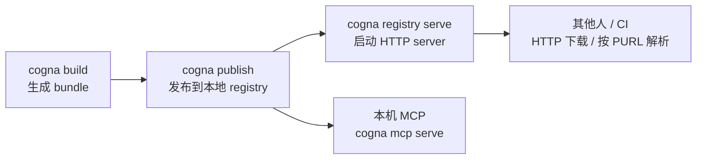

# 共享 Bundle

你可能在开发机上构建了一个 SDK 的 bundle，现在想把它分享给其他人——让他们也能用 `cogna query` 查询，或者让 CI 从一个统一的地方拉取，而不是每次都重新构建。这就是 bundle 共享要解决的问题。

## 核心流程



---

## 发布 bundle

构建完成后，把 bundle 发布到本地 registry：

```bash
cd ./sdk
cogna build
cogna publish
```

发布成功后，bundle 会被本地 registry 按 PURL 索引，后续可以用 PURL 快速定位。

---

## 按 PURL 下载

发布后，你（或其他人）可以通过 registry HTTP API 按 PURL 解析，再把 bundle 下载到指定目录：

```bash
# 先解析 PURL
curl "http://localhost:8787/api/v1/bundles/resolve?purl=pkg:cargo/tokio@1.43.0"

# 再下载 bundle
curl -o bundle.ciq.tgz \
  "http://localhost:8787/api/v1/bundles/<bundleId>/download"
```

PURL 格式是 `pkg:<type>/<namespace>/<name>@<version>`，在 `cogna.yml` 的 `purl` 字段中配置。

---

## 启动 HTTP Registry Server

如果你想让团队内的其他机器或 CI 通过 HTTP 下载 bundle，可以启动一个本地 registry server，或者直接把它跑进容器：

```bash
cogna registry serve --port 8787
```

```bash
docker build -f integrations/deployments/docker/Dockerfile -t cogna-registry:local .
docker run --rm \
  -p 8787:8787 \
  -e COGNA_REGISTRY_STORE_DIR=/data/registry \
  -v "$PWD/.cogna-docker-registry:/data/registry" \
  cogna-registry:local
```

启动后，可用的 API 端点：

| 端点 | 说明 |
|------|------|
| `GET /health` | 检查 server 是否运行 |
| `GET /api/v1/bundles/resolve?purl=...` | 按 PURL 查找 bundle ID |
| `GET /api/v1/packages/{purl}/versions` | 列出某个包的所有已发布版本 |
| `GET /api/v1/bundles/{bundleId}` | 获取 bundle 元数据 |
| `GET /api/v1/bundles/{bundleId}/download` | 下载 bundle 文件 |
| `POST /api/v1/bundles` | 上传新 bundle |

**示例：通过 HTTP 按 PURL 下载**

```bash
# 1. 先解析 PURL 得到 bundle ID
BUNDLE_ID=$(curl -s "http://localhost:8787/api/v1/bundles/resolve?purl=pkg:cargo/mylib@1.0.0" \
  | python3 -c "import json,sys; print(json.load(sys.stdin)['bundleId'])")

# 2. 下载 bundle
curl -o bundle.ciq.tgz \
  "http://localhost:8787/api/v1/bundles/${BUNDLE_ID}/download"
```

---

## 什么时候用 bundle 共享？

| 场景 | 做法 |
|------|------|
| 本机 CLI 和 MCP 复用同一份 bundle | `cogna publish` + `cogna mcp serve` |
| 团队内部共享最新 SDK 快照 | `cogna registry serve` 或 Docker 化 registry + HTTP 下载 |
| CI 从固定版本构建而不是每次重建 | 提前 publish，CI 调 registry HTTP API |
| Policy bundle 版本化分发 | 同样用 `publish` + registry HTTP API |

---

## 下一步

- PURL 格式和 `cogna.yml` 配置：[配置参考](/docs/config)
- MCP 命令和 HTTP 接口完整参考：[MCP / Registry 参考](/docs/runtime-reference)
