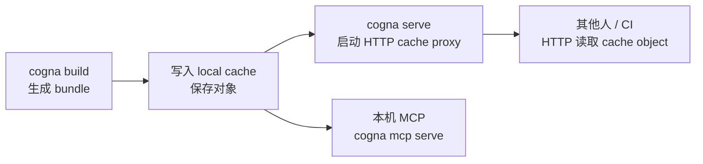

# 共享 Bundle

你可能在开发机上构建了一个 SDK 的 bundle，现在想把它分享给其他人——让他们也能用 `cogna query` 查询，或者让 CI 从一个统一的地方拉取 cache object，而不是每次都重新构建。这就是 bundle 共享要解决的问题。

## 核心流程



---

## 管理 local cache

构建完成后，你可以直接把文件加入当前 workspace 的 local cache：

```bash
cd ./sdk
cogna build
cogna cache add --key blob/sha256/example --file ./dist/bundle.ciq.tgz
```

也可以先查看已有对象：

```bash
cogna cache list
```

---

## 通过 HTTP 读取对象

当 `cogna serve` 指向 local 或 http backend 时，其他机器可以通过最小 cache object API 读取对象：

```bash
curl -o bundle.ciq.tgz \
  "http://localhost:8787/cache/v1/object?key=blob%2Fsha256%2Fexample"
```

当前 v1 proxy 只暴露 `key -> object` 语义；PURL 和 manifest 如何映射到 key，由 build / cache 侧维护。

---

## 启动 HTTP Cache Proxy

如果你想让团队内的其他机器或 CI 通过 HTTP 复用 cache，可以启动一个本地 cache proxy，或者直接把它跑进容器：

```bash
cogna serve --port 8787
```

```bash
docker build -f integrations/deployments/docker/Dockerfile -t cogna-cache-proxy:local .
docker run --rm \
  -p 8787:8787 \
  -v "$PWD/.cogna-docker-cache:/data/cache" \
  cogna-cache-proxy:local
```

启动后，可用的 API 端点：

| 端点 | 说明 |
|------|------|
| `GET /health` | 检查 server 是否运行 |
| `GET /cache/v1/object?key=...` | 读取 cache object |
| `PUT /cache/v1/object?key=...` | 写入 cache object |

**示例：通过 HTTP 下载 cache object**

```bash
# 下载 bundle object
curl -o bundle.ciq.tgz \
  "http://localhost:8787/cache/v1/object?key=blob%2Fsha256%2Fexample"
```

---

## 什么时候用 bundle 共享？

| 场景 | 做法 |
|------|------|
| 本机 CLI 和 MCP 复用同一份 bundle | `cogna build` + `cogna mcp serve` |
| 团队内部共享最新 SDK 快照 | `cogna serve` 或 Docker 化 cache proxy + HTTP 下载 |
| CI 从固定版本构建而不是每次重建 | 提前准备 cache object，CI 调 cache HTTP API |
| Policy bundle 版本化分发 | 同样通过 cache object 分发 |

---

## 下一步

- PURL 格式和 `cogna.yml` 配置：[配置参考](/docs/config)
- MCP 命令和 HTTP 接口完整参考：[MCP / Cache 参考](/docs/runtime-reference)
