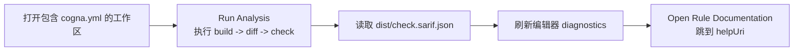

# IDE 集成

Cogna 现在提供了仓库内的 **VSCode 扩展实现**（位于 `integrations/vscode/`）。它复用本地 `cogna` CLI，读取 `dist/check.sarif.json`，并把 policy 结果映射成编辑器 diagnostics。

当前扩展覆盖三件事：

1. **运行分析**：按 `build -> diff -> check` 顺序调用本地 `cogna`
2. **加载 diagnostics**：读取 `dist/check.sarif.json` 并在编辑器中标注问题
3. **打开规则文档**：根据 SARIF 中的 `helpUri` 跳转到稳定的策略文档页

---

## 支持的命令

- `Cogna: Run Analysis`
- `Cogna: Refresh Diagnostics`
- `Cogna: Open Rule Documentation`

## 支持的设置

- `cogna.cliPath`
- `cogna.workingDirectory`
- `cogna.runOnSave`
- `cogna.autoOpenPolicyDocs`

## 本地使用方式

先在仓库内安装并编译扩展：

```bash
cd integrations/vscode
npm install
npm run compile
```

然后在 VSCode Extension Development Host 中打开一个包含 `cogna.yml` 的工作区，并确保本机能执行 `cogna`。扩展会优先读取：

- `cogna.workingDirectory`（若已配置）
- 否则读取当前第一个 workspace folder

分析完成后，扩展会从 `<working-directory>/dist/check.sarif.json` 读取结果并刷新 diagnostics。

## 当前工作流



---

## 本地验证

扩展目录已带上最小验证脚本：

```bash
cd integrations/vscode
npm install
npm run compile
npm run test:unit
npm run test:extension
```

其中 `test:extension` 会准备一个临时 workspace、安装本地 `cogna` CLI、写入示例 SARIF，然后在 VSCode test host 中验证命令注册、diagnostics 刷新、文档跳转与完整分析流程。

---

## 如果你更偏好 AI / MCP 工作流

除了 VSCode 扩展，你仍然可以继续使用 MCP 让 AI 编程助手直接查询本地 bundle：

```bash
cogna mcp serve --port 3000
```

- `cogna.query.outlines` — 列出所有公开符号路径
- `cogna.query.symbol` — 查询某个函数的完整签名和文档

---

## 下一步

- 在 CI 中接入 SARIF 上传：[持续集成](/docs/ci)
- 了解 SARIF 字段与规则文档：[启用 SARIF 集成](/docs/sarif)
- 继续使用 MCP 查询 bundle：[AI 查询（MCP）](/docs/mcp)
