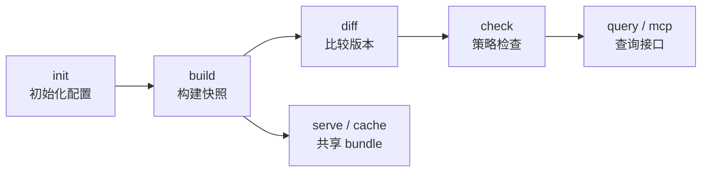

# 什么是 Cogna？

Cogna 是一个本地命令行工具，帮你回答一个核心问题：

> **"这次版本发布，对外的公开接口到底变了什么？这些变化会不会造成兼容性问题？"**

不管你在维护一个 Go 库、Rust crate、Terraform Module，还是 OpenAPI 规格，在发版前你都需要回答这个问题——而 Cogna 的目标就是让这件事变得可靠、可重复、可以接进 CI。

## 它能帮你做什么？

Cogna 围绕一个本地工作流展开：

| 步骤 | 你得到什么 |
|------|-----------|
| `cogna init` | 一份 `cogna.yml` 配置文件 |
| `cogna build` | 一个包含公开声明快照的 bundle（`dist/bundle.ciq.tgz`） |
| `cogna diff` | 两个版本之间的结构化变更报告（`dist/diff.json`） |
| `cogna check` | 基于 OPA policy 的兼容性检查结果，SARIF 格式（`dist/check.sarif.json`） |
| `cogna mcp` | 精确查询某个符号、接口或契约的当前状态 |
| `cogna serve` / `cogna cache` | 通过 cache proxy 与 local cache 复用 bundle |

## 跟其他工具有什么区别？

Cogna 不是 linter，也不是 LSP，更不是 IDE 插件。它关注的是**公开接口的契约级别变化**，而不是代码风格、实现细节或编辑器体验。

举个例子：

- `git diff` 能告诉你文件里改了哪些行
- Cogna 能告诉你：这个函数的参数类型变了，原来是 `*Context` 现在是 `Context`，而且这是个 breaking change

## 支持哪些语言和规格？

| 类型 | profile 名称 |
|------|---------|
| Go module | `go-module` |
| Rust crate | `rust-crate` |
| Terraform Module | `terraform-module` |
| OpenAPI 规格 | `openapi-spec` |
| OPA Policy Bundle | `policy-bundle` |

## 当前状态

Cogna 目前是**完全本地的**：所有命令都在你自己的机器上运行，bundle 也存在本地。没有云端服务，没有网络依赖。

当前 Go / Rust 抽取链路已经切到 **single canonical author path + optional LSP validation**：`validation=none` 与 `validation=lsp` 针对同一份代码必须产出相同的最终 bundle，LSP 只负责验证，不再 author 第二份 backend truth。

这意味着你现在就可以：

- 在本机运行完整的 build → diff → check → query 流程
- 把 SARIF 结果接进已有 CI 或代码审查系统
- 用 MCP 让本地 AI Agent 查询真实接口，而不是靠猜

## 从哪里开始？

- **第一次使用**：跟着[快速开始](/docs/quickstart)跑一遍完整流程
- **想直接看命令**：查 [CLI 参考](/docs/cli)
- **需要了解配置**：看[配置与 PURL](/docs/config)
