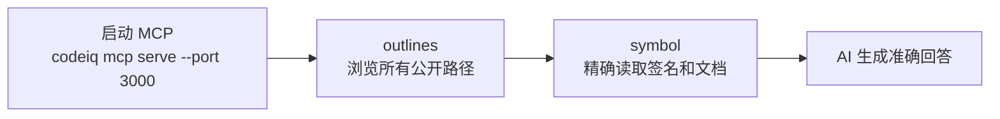

# AI 查询（MCP）

CodeIQ 通过本地 MCP server 把 bundle 内容暴露给 AI 工具。当前命令面已经收口为：

- `codeiq mcp serve`
- `codeiq mcp status`

也就是说，MCP 现在是一个**前台服务进程**；是否由外部 supervisor、容器或 IDE 负责后台常驻，由你自己决定。

## 两种查询方式

| 使用场景 | 命令 |
|----------|------|
| 一次性查询（脚本 / CI） | `codeiq query <query-file>` |
| AI / Agent 多轮查询 | `codeiq mcp serve --port 3000` |

---

## 快速开始

```bash
# 1. 先构建 bundle
codeiq build

# 2. 在前台启动 MCP server
codeiq mcp serve --port 3000

# 3. 另一个终端里查看状态
codeiq mcp status
```

---

## MCP 提供的工具

### `codeiq.query.outlines`

按 PURL 返回公开路径大纲，适合先缩小范围。

### `codeiq.query.symbol`

按路径读取具体声明。`kind` 当前是可选的；如果不传，服务端会做 ranked matching。

### `codeiq.runtime.context`

返回当前 runtime 看到的 bundle / registry 上下文，适合调试和确认加载状态。

---

## 推荐查询顺序



---

## 与 Registry 的关系

MCP 自己不负责构建 bundle。常见做法是：

1. `codeiq build`
2. `codeiq publish`
3. `codeiq registry serve --port 8787`
4. `codeiq mcp serve --port 3000`

这样 CLI、registry、MCP 三者都围绕同一份本地 bundle / store 工作。

---

## 下一步

- 查询文件格式与 ranked matching：[CLI 参考](/docs/cli)
- registry 与 HTTP API：[MCP / Registry 参考](/docs/runtime-reference)
- 整体运行链路：[工作方式](/docs/runtime-model)
