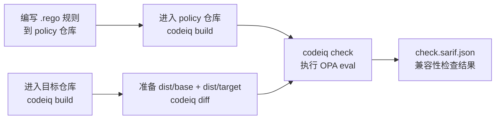

# 定制 OPA 自动审查策略

CodeIQ 的兼容性检查是由 OPA（Open Policy Agent）驱动的。你可以用 Rego 语言写自己的策略规则，打包成 policy bundle，然后让 `codeiq check` 用它来判断哪些 API 变化是可接受的，哪些需要阻止或警告。

## 整体流程



---

## 第一步：创建 policy 仓库

在你的 policy 仓库里初始化配置：

```bash
codeiq init
```

在生成的 `codeiq.yml` 中，把 `profile` 设置为：

```yaml
schemaVersion: ciq-config/v2
profile: policy-bundle
purl: pkg:generic/myorg/compat-policy@1.0.0
source:
  repo: https://github.com/myorg/compat-policy
  ref: main
inputs:
  include:
    - "**/*.rego"
```

---

## 第二步：编写 Rego 规则

在 policy 仓库的 `rego/` 目录下创建规则文件。CodeIQ 的 `check` 命令会执行 `data.codeiq.compat.deny`。

### 示例：禁止删除任何公开函数

```rego
# rego/compat.rego
package codeiq.compat

import future.keywords.if

deny[result] if {
    change := input.changes[_]
    change.kind == "removed"
    change.level == "error"
    result := {
        "ruleId": "custom.no-removal",
        "level": "error",
        "message": sprintf("symbol '%s' was removed", [change.path]),
        "uri": change.beforeRecord.uri,
        "startLine": change.beforeRecord.startLine
    }
}
```

### 示例：对 warning 级别变化发出 warning

```rego
# rego/warnings.rego
package codeiq.compat

warn[result] if {
    change := input.changes[_]
    change.level == "warning"
    result := {
        "ruleId": "custom.signature-changed",
        "level": "warning",
        "message": sprintf("'%s' signature changed, verify callers", [change.path]),
        "uri": change.afterRecord.uri,
        "startLine": change.afterRecord.startLine
    }
}
```

---

## 第三步：构建 policy bundle

```bash
cd ./policy
codeiq build
```

构建完成后，`dist/` 中会有：

```text
dist/
├── manifest.json          ← bundle 元数据
├── opa-bundle.tar.gz      ← OPA 可执行载荷（给 opa eval 用）
├── policy.rules.json      ← 规则目录（供 SARIF driver 用）
├── metadata.json
├── checksums.txt
└── bundle.ciq.tgz         ← 给 `checks.policy` 引用的文件
```

---

## 第四步：对目标仓库执行检查

```bash
# 在 policy 仓库里先构建 policy bundle
cd ./policy
codeiq build

# 回到目标仓库目录
cd ../sdk

# 构建当前 bundle
codeiq build

# 准备 dist/base 与 dist/target 两套产物后生成 diff
codeiq diff

# 在 codeiq.yml 里把 checks.policy 指向 ../policy/dist/bundle.ciq.tgz
codeiq check
```

当前 CLI 不暴露 `--policy` 或 `--since` 参数；它们分别由 `codeiq.yml -> checks.policy` 和你准备好的 `dist/base` / `dist/target` 决定。

检查完成后会生成：

```text
./sdk/dist/check.sarif.json
```

---

## 内置规则（无需自己编写即可使用）

CodeIQ 自带一套 built-in policy，覆盖常见的兼容性场景。你不需要自己维护这些规则，只需要构建 SDK bundle 和执行 `check` 即可。

| 规则系列 | 覆盖的变化类型 |
|----------|---------------|
| `compat.core.*` | 通用声明删除、breaking change 基础规则 |
| `compat.go.*` | Go 导出函数签名、receiver、method set、unsafe 变化 |
| `compat.rust.*` | Rust public item、extern ABI、where clause、unsafe 变化 |
| `compat.terraform.*` | variable requiredness、output 删除、provider/lifecycle 变化 |
| `compat.openapi.*` | parameter requiredness、response status 删除、schema 收窄 |
| `compat.component.*` | 软件组件级别的版本变化 |

如果你的团队需要更细的规则，可以在自己的 policy 仓库里**扩展或覆盖**这些内置规则。

内置规则的 canonical 文档与 `helpUri` 现在由同一份 policy catalog 自动生成，见：[内置策略规则目录](/docs/policies)。

---

## SARIF 结果示例

执行 `check` 后，`check.sarif.json` 会包含：

```json
{
  "version": "2.1.0",
  "runs": [{
    "tool": {
      "driver": {
        "name": "CodeIQ",
        "rules": [
          {
            "id": "custom.no-removal",
            "helpUri": "https://your-team-docs/policy/no-removal"
          }
        ]
      }
    },
    "results": [
      {
        "ruleId": "custom.no-removal",
        "level": "error",
        "message": { "text": "symbol 'MyAPI.processRequest' was removed" },
        "locations": [{
          "physicalLocation": {
            "artifactLocation": { "uri": "src/api.go" },
            "region": { "startLine": 42 }
          }
        }]
      }
    ]
  }]
}
```

---

## 下一步

- 发版前检查完整流程：[发版检查](/docs/release-check)
- 了解 SARIF 结构：[启用 SARIF 集成](/docs/sarif)
- 在 CI 中运行检查：[持续集成](/docs/ci)
