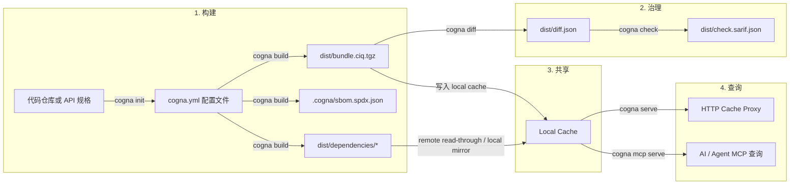

# 工作方式

Cogna 当前仍然是**local-first**：你在本地仓库里构建 bundle，本地 cache 负责保存和复用对象，`cogna serve` 把 cache 暴露成 HTTP proxy，MCP 负责把这些 bundle 暴露给 AI / Agent。

---

## 完整流程一览



---

## 现在的几个关键事实

### 1. 配置文件默认是 `cogna.yml`

`cogna init` 默认生成 `cogna.yml`。旧文件名 `cogna.yaml` 仍兼容读取，但新的命令说明、测试和示例都统一使用 `cogna.yml`。

### 2. SBOM 已收口为 SPDX-only

构建后会产出：

- `.cogna/sbom.spdx.json`

不再生成 CycloneDX 文件。

### 3. Cache 负责本地复用，HTTP cache 负责远端 read-through

默认 local cache 根目录是：

1. `cogna.yml -> cache.local.storeDir`
2. `.cogna/cache`

当 `cache.type=http` 时，build 会按 `local miss -> http hit -> 回填 local` 的顺序复用依赖结果。

### 4. MCP 命令面已经收口

当前暴露给 CLI 的是：

- `cogna mcp serve`
- `cogna mcp status`

不再把后台 start/stop 作为当前主文档推荐路径。

---

## Cache Proxy 与 Docker

如果你要把 cache proxy 作为容器运行，推荐方式是：

```bash
docker build -f integrations/deployments/docker/Dockerfile -t cogna-cache-proxy:local .

docker run --rm \
  -p 8787:8787 \
  -v "$PWD/.cogna-docker-cache:/data/cache" \
  cogna-cache-proxy:local
```

这样容器里的 cache 数据会直接持久化到挂载目录。

---

## 为什么现在仍然是 local-first

因为 Cogna 现在最强调的是：

- 本地仓库即可完成 build → diff → check → query
- 不需要云端账号或托管控制面
- AI 查询直接基于本机真实 bundle，而不是依赖源码猜测

---

## 下一步

- 看命令面与默认值：[CLI 参考](/docs/cli)
- 看 cache / MCP 接口细节：[MCP / Cache 参考](/docs/runtime-reference)
- 看 bundle 产物结构：[Bundle 与结果文件参考](/docs/indexing)
