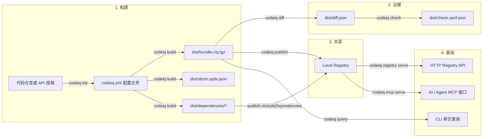

# 工作方式

CodeIQ 当前仍然是**单机闭环**：你在本地仓库里构建 bundle，本地 registry 负责按 PURL 存储和分发，MCP 负责把这些 bundle 暴露给 AI / Agent。

---

## 完整流程一览



---

## 现在的几个关键事实

### 1. 配置文件默认是 `codeiq.yml`

`codeiq init` 默认生成 `codeiq.yml`。旧文件名 `codeiq.yaml` 仍兼容读取，但新的命令说明、测试和示例都统一使用 `codeiq.yml`。

### 2. SBOM 已收口为 SPDX-only

构建后会产出：

- `software-components.ndjson`
- `sbom.spdx.json`

不再生成 CycloneDX 文件。

### 3. Registry 和 Publish 会复用同一套本地 store

store 目录优先级：

1. `CODEIQ_REGISTRY_STORE_DIR`
2. `codeiq.yml -> registry.storeDir`
3. `.codeiq/cache/registry`

这让本地开发、CI、容器运行都能复用相同语义。

### 4. MCP 命令面已经收口

当前暴露给 CLI 的是：

- `codeiq mcp serve`
- `codeiq mcp status`

不再把后台 start/stop 作为当前主文档推荐路径。

---

## Registry 与 Docker

如果你要把 registry 作为容器运行，推荐方式是：

```bash
docker build -f Dockerfile.registry -t codeiq-registry:local .

docker run --rm \
  -p 8787:8787 \
  -e CODEIQ_REGISTRY_STORE_DIR=/data/registry \
  -v "$PWD/.codeiq-docker-registry:/data/registry" \
  codeiq-registry:local
```

这样容器里的 registry 数据会直接持久化到挂载目录。

---

## 为什么现在仍然是 local-first

因为 CodeIQ 现在最强调的是：

- 本地仓库即可完成 build → diff → check → publish → query
- 不需要云端账号或托管控制面
- AI 查询直接基于本机真实 bundle，而不是依赖源码猜测

---

## 下一步

- 看命令面与默认值：[CLI 参考](/docs/cli)
- 看 registry / MCP 接口细节：[MCP / Registry 参考](/docs/runtime-reference)
- 看 bundle 产物结构：[Bundle 与结果文件参考](/docs/indexing)
