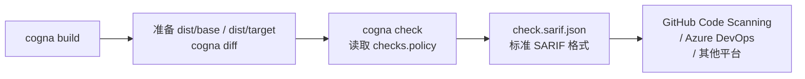

# 启用 SARIF 集成

SARIF（Static Analysis Results Interchange Format）是一种标准化的静态分析结果格式，被 GitHub Code Scanning、Azure DevOps、SonarQube 等众多平台广泛支持。Cogna 的 `check` 命令在执行 policy 检查后，会自动把结果输出为 SARIF 文件，你可以把它接入任何支持 SARIF 的平台，无需额外转换。

## 生成 SARIF 的完整步骤



### 执行命令

```bash
cd ./sdk
cogna build
cogna diff
cogna check
```

生成的 SARIF 文件位于：

```text
./sdk/dist/check.sarif.json
```

---

## SARIF 文件结构解析

下面是一个完整的 `check.sarif.json` 示例，标注了每个字段的含义：

```json
{
  "version": "2.1.0",
  "$schema": "https://json.schemastore.org/sarif-2.1.0.json",
  "runs": [
    {
      "tool": {
        "driver": {
          "name": "Cogna",
          "version": "0.1.0",
          "rules": [
            {
              "id": "compat.go.signature-changed",
              "name": "SignatureChanged",
              "helpUri": "https://cogna.xaclabs.dev/docs/policies/generated/go/signature-changed",
              "defaultConfiguration": {
                "level": "warning"
              }
            }
          ]
        }
      },
      "results": [
        {
          "ruleId": "compat.go.signature-changed",
          "level": "error",
          "message": {
            "text": "function 'Client.Do' signature changed: parameter 'ctx context.Context' was added"
          },
          "locations": [
            {
              "physicalLocation": {
                "artifactLocation": {
                  "uri": "client/client.go"
                },
                "region": {
                  "startLine": 87
                }
              }
            }
          ]
        }
      ]
    }
  ]
}
```

### 字段说明

| 字段 | 含义 |
|------|------|
| `ruleId` | 触发的 policy 规则 ID，例如 `compat.go.signature-changed` |
| `level` | 严重程度：`error`（高风险）/ `warning`（需确认）/ `note`（提示） |
| `message.text` | 对这条结果的人类可读说明 |
| `artifactLocation.uri` | 变化发生在哪个文件 |
| `region.startLine` | 变化的起始行号 |
| `tool.driver.rules[].helpUri` | 规则文档链接；built-in rules 会稳定指向 `/docs/policies/generated/<family>/<rule>` |

---

## 接入 GitHub Code Scanning

当前推荐的方式不是手写 `curl install + cogna check + upload-sarif`，而是直接复用仓库内的组合动作：

```yaml
name: Cogna Compatibility Check

on:
  pull_request:
    branches: [main]

jobs:
  check:
    runs-on: ubuntu-latest
    permissions:
      contents: read
      security-events: write
    steps:
      - uses: actions/checkout@v4
        with:
          fetch-depth: 0

      - uses: ./integrations/actions/setup-moonbit

      - uses: ./integrations/actions/setup-cogna

      - uses: ./integrations/actions/run-cogna
        with:
          working-directory: ./sdk
          command: check
          upload-sarif: true
```

其中：

- `setup-moonbit` 负责安装 MoonBit；
- `setup-cogna` 负责从当前仓库源码产出 `cogna` CLI；
- `run-cogna` 在 `command: check` 时会查找 `dist/check.sarif.json`，构造 gzip + base64 的 SARIF payload，并通过 GitHub Code Scanning REST API 上传。

上传后，GitHub 会在 Pull Request 页面直接显示兼容性警告，点击可以跳转到对应的源文件行；对于 built-in rules，还可以继续通过 `helpUri` 跳到稳定的规则文档页。

本仓库同时提供了本地 `act` 端到端验证路径：当 `ACT=true` 时，`run-cogna` 不会真的调用 GitHub API，而是把 upload payload capture 到本地文件，供 workflow 断言 `commit_sha`、`ref` 与压缩后的 `sarif` 字段。

---

## 如何读懂检查结果

拿到 `check.sarif.json` 后，按这个优先级来读：

1. **先看 `level: error`** — 这些是高风险变化，通常意味着调用方会出错
2. **再看 `level: warning`** — 这些值得重点确认，但可能在某些场景下是可接受的
3. **最后看 `level: note`** — 补充信息，通常不需要立即处理

对每一条结果，关注：
- `ruleId` — 是哪条 policy 规则触发的
- `message.text` — 具体发生了什么变化
- `uri` + `startLine` — 变化在哪个文件的哪一行

---

## 下一步

- 了解 policy 规则编写：[定制 OPA 自动审查策略](/docs/policy)
- 在 CI 中运行完整流程：[持续集成](/docs/ci)
- 了解发版检查流程：[发版检查](/docs/release-check)
