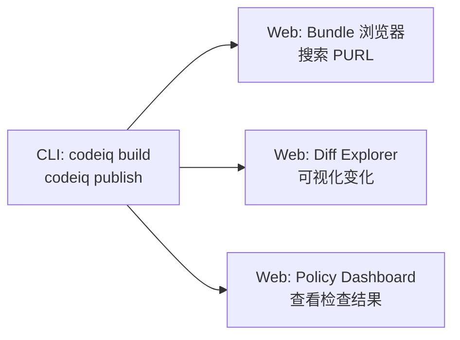

# Web 界面

<span style="display:inline-block;background:#fef3c7;color:#92400e;border:1px solid #f59e0b;border-radius:6px;padding:4px 12px;font-size:0.9rem;font-weight:600;">⚠️ 尚未支持</span>

CodeIQ 目前没有独立的 Web UI。在线 bundle 浏览器、diff explorer 和 policy dashboard 正在规划中，但还没有正式发布。

---

## 未来的 Web 体验（规划中）

我们计划提供一个 **Web 控制台**，支持以下功能：

### Bundle 浏览器

在浏览器中搜索和浏览已发布的 bundle：

- 按 PURL 搜索（例如 `pkg:cargo/tokio@1.43.0`）
- 浏览 bundle 中的所有公开声明
- 查看函数签名、文档和版本历史

### 在线 Diff Explorer

在网页上对比两个版本的变化：

- 可视化展示 breaking changes
- 按严重程度（error / warning / note）筛选
- 点击跳转到具体变化详情

### Policy Dashboard

- 查看历史检查结果
- 按仓库、版本、规则筛选
- 导出 SARIF 报告

预期工作流示意：



---

## 今天的替代方案

### 场景一：团队内共享 bundle

运行本地 registry server，暴露最小 HTTP 接口：

```bash
cd ./sdk
codeiq build
codeiq publish
codeiq registry serve --port 8787
```

其他人可以通过 HTTP 下载 bundle：

```bash
# 按 PURL 解析 bundle
curl "http://localhost:8787/api/v1/bundles/resolve?purl=pkg:cargo/mylib@1.0.0"

# 下载 bundle
curl "http://localhost:8787/api/v1/bundles/{bundleId}/download" -o bundle.ciq.tgz
```

### 场景二：把检查结果接入已有系统

运行 `codeiq check` 后，把生成的 SARIF 文件接入你已有的代码审查平台：

```bash
cd ./sdk
codeiq build

# 先准备 dist/base 与 dist/target
codeiq diff

# policy bundle 路径来自 codeiq.yml -> checks.policy
codeiq check

# 得到的产物可以交给已有系统
ls ./sdk/dist/
# diff.json          ← 结构化变更列表，可供脚本解析
# check.sarif.json   ← 标准 SARIF，可上传到任何支持 SARIF 的平台
# bundle.ciq.tgz     ← bundle 归档，可通过 registry 分发
```

### 场景三：查看 diff 结果

目前可以直接读 JSON：

```bash
# 查看变更摘要
cat ./sdk/dist/diff.json | python3 -m json.tool | grep -A5 '"summary"'

# 查看所有 error 级别的变化
cat ./sdk/dist/diff.json | python3 -c "
import json, sys
d = json.load(sys.stdin)
for c in d.get('changes', []):
    if c.get('level') == 'error':
        print(c.get('path'), '-', c.get('kind'))
"
```

---

## 下一步

- 了解 SARIF 集成：[启用 SARIF 集成](/docs/sarif)
- 本地共享 bundle：[共享 Bundle](/docs/bundle-sharing)
- MCP / Registry 参考：[MCP / Registry 参考](/docs/runtime-reference)
