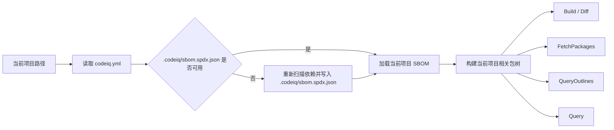

# CodeIQ 用户侧 API 说明（重构草案）

本文定义下一轮 **用户侧 API** 的目标形态。

重点不是把当前 proto 中的内部结构逐字段暴露出来，而是重新收口为一组面向产品使用场景的稳定接口：

- 命令面只保留 `Build` 和 `Diff`
- 查询面只保留 `FetchPackages`、`QueryOutlines`、`Query`
- `Bundle`、`bundleId`、`bundlePath`、内部 SQL 表等概念都不直接暴露给最终用户

因此，本文描述的是 **下一轮 public API contract**，而不是当前仓库 reality 的逐字段镜像。当前实现仍然存在 `bundle.ciq.tgz`、registry bundle store、selector query、MCP outlines/symbol 工具等内部或过渡形态；这些实现细节在后续重构中应逐步降级为内部机制，而不是继续占据用户侧 API 的主叙事。

二维表 / SQL 查询模型已明确降级为**远期能力**，不属于当前阶段的设计重点。当前阶段只关心三件事：

1. 用户侧 API 收口
2. 当前项目上下文与 `.codeiq/sbom.spdx.json` 缓存机制
3. 基于 proto 的双端数据类型生成（MoonBit + Node TypeScript）

---

## 1. 设计目标

### 1.1 用户不感知 Bundle

`Bundle` 是内部产物，不是用户侧 API 的核心概念。

对用户来说，他们真正关心的是：

- 当前项目能否成功构建索引
- 与基线相比有哪些公开接口变化
- 当前项目依赖了哪些包
- 某个包下面有哪些公开接口
- 如何精确或模糊查询某个符号/接口

因此下一轮 API 应把 `Bundle` 退回到内部实现层：

- `Build` 不返回 bundle 引用、bundle 路径、digest、etag
- `Diff` 不返回 base/target bundle locator
- 查询类 API 只接受“包名”与查询条件，不要求用户提供 `purl` / `bundle_id` / `bundle_path`

### 1.2 所有接口都隐含当前项目上下文

所有接口都以“当前项目”为起点，而不是先让用户显式传一大批上下文参数。

对任意一次调用，系统都应先做这件事：

1. 解析当前项目路径（通常是当前工作目录）
2. 读取当前项目 `codeiq.yml`
3. 读取或刷新当前项目 `.codeiq/sbom.spdx.json`
4. 从这个 SBOM 推导当前项目相关的包集合
5. 再执行 `Build` / `Diff` / `FetchPackages` / `QueryOutlines` / `Query`

换句话说，**当前项目路径是隐式上下文，当前项目 SBOM 是隐式查询入口。**

### 1.3 当前项目 SBOM 要缓存到 `.codeiq/`

SBOM 只需要服务当前项目上下文发现，不需要继续作为三方包公开产物的一部分广泛分发。

新的设计约束是：

- 当前项目的 SBOM 缓存到项目根目录下的 `.codeiq/sbom.spdx.json`
- 若缓存不存在、失效或与当前依赖状态不一致，则重新生成并覆盖缓存
- 三方包的 SBOM 不再作为用户侧 API 的一部分暴露
- 三方包的索引/查询产物可以继续存在，但其 SBOM 不应继续成为 public contract 的核心内容

这里的判断是：

> 当前项目 SBOM 对“发现项目依赖了哪些包”非常重要；但三方包自己的 SBOM 对“浏览公开 API / 精确查询符号”价值很低，不值得继续把它放在 public API 的主 contract 中。

---

## 2. 隐式上下文解析流程



### 2.1 缓存路径

本文建议把当前项目上下文缓存统一收口到项目根目录下：

```text
.codeiq/
└── sbom.spdx.json
```

后续如果确实需要额外缓存，可以再补充：

- `.codeiq/query/`
- `.codeiq/packages/`
- `.codeiq/index/`

但当前阶段只把 `sbom.spdx.json` 设为必需缓存，避免过早引入多层缓存协议。

### 2.2 缓存刷新原则

查询类 API 不应每次都全量重建依赖上下文，而应采用：

- **优先读取** `.codeiq/sbom.spdx.json`
- **必要时刷新**：例如 `codeiq.yml`、lockfile、manifest、workspace 配置、依赖清单变化后再重算
- `Build` 应负责确保当前项目 SBOM 缓存处于最新状态

---

## 3. API 总览

下一轮用户侧 API 应统一收口为 5 个接口：

| 接口 | 类型 | 输入 | 输出 | 用户视角作用 |
|------|------|------|------|--------------|
| `Build` | 命令 | 无显式业务参数 | 成功 / 失败 | 为当前项目建立可查询上下文 |
| `Diff` | 命令 | 比较范围 | 差异结果 | 比较当前项目与基线的接口变化 |
| `FetchPackages` | 查询 | 无参数 | 包树 | 展示与当前项目相关的包列表 |
| `QueryOutlines` | 查询 | 包名 | 公开接口大纲 | 浏览某个包的公开 API |
| `Query` | 查询 | 包名 + 查询参数 | 查询结果 | 精确检索或模糊搜索某个包里的接口 |

这里的关键词是：

- `Build` / `Diff` 面向命令工作流
- `FetchPackages` / `QueryOutlines` / `Query` 面向 UI、SDK、AI Agent、IDE

---

## 4. 公共数据类型

## 4.1 PackageNode

`FetchPackages` 返回的树节点建议采用如下逻辑结构：

| 字段 | 类型 | 含义 |
|------|------|------|
| `name` | `string` | 包名，作为用户侧主标识 |
| `version` | `string?` | 版本号 |
| `ecosystem` | `string?` | 生态，例如 `npm` / `cargo` / `go` |
| `relation` | `string` | 与当前项目关系：`root` / `workspace` / `direct` / `transitive` |
| `summary` | `string?` | 简短说明，供 UI 展示 |
| `children` | `PackageNode[]` | 子节点 |

设计要求：

- 这是一棵“浏览树”，不是严格无重复的依赖图
- 同一包如果通过多条依赖路径被引用，可以在不同父节点下重复出现
- 用户侧以“可浏览、可展开、可定位”为优先，而不是追求最底层去重模型

## 4.2 Outline

`QueryOutlines` 返回的每一条公开接口摘要建议至少包含：

| 字段 | 类型 | 含义 |
|------|------|------|
| `id` | `string` | 稳定接口 ID |
| `symbol` | `string` | 公开符号名 / canonical path |
| `kind` | `string` | 类型，例如 `function` / `method` / `type` / `operation` |
| `summary` | `string?` | 简短摘要 |
| `deprecated` | `bool` | 是否已废弃 |
| `location` | `object?` | 源文件位置 |

`Outline` 的目标是浏览，而不是返回完整 declaration payload。

## 4.3 QueryPattern

`Query` 需要同时支持两类检索：

1. **精确检索**
   - 按 `id` 精确命中
   - 按 `symbol` 精确命中
2. **模糊检索**
   - 按文本关键字做 ranked fuzzy search

因此查询参数建议抽象为：

| 字段 | 类型 | 含义 |
|------|------|------|
| `exact_id` | `string?` | 按稳定 ID 精确查询 |
| `exact_symbol` | `string?` | 按符号名 / canonical path 精确查询 |
| `text` | `string?` | 文本模糊查询 |
| `limit` | `int?` | 限制返回结果数 |
| `cursor` | `string?` | 分页游标 |

约束：

- `exact_id`、`exact_symbol`、`text` 三者只能三选一
- `exact_*` 用于“我知道要找什么”
- `text` 用于“我只知道关键字或语义片段”

## 4.4 QueryMatch

`Query` 输出的匹配项建议包含：

| 字段 | 类型 | 含义 |
|------|------|------|
| `id` | `string` | 稳定接口 ID |
| `symbol` | `string` | 符号或 canonical path |
| `kind` | `string` | 声明种类 |
| `signature` | `string?` | 规范化签名 |
| `summary` | `string?` | 摘要 |
| `docs` | `string?` | 文档片段 |
| `score` | `double?` | 模糊检索时的排序分值 |
| `location` | `object?` | 代码位置 |

对于精确查询，`matches` 通常长度为 `0` 或 `1`；对于模糊查询，则可能返回多个候选项。

---

## 5. Build

## 5.1 目标

`Build` 只回答一件事：

> 当前项目是否已成功建立可查询上下文？

它不应该把内部产物细节暴露给用户，不返回 bundle 文件路径、bundle 引用、digest、download URL、etag，也不要求用户理解内部打包结构。

## 5.2 行为

`Build` 的内部行为可以继续很复杂，但用户侧只需要关心结果：

1. 解析当前项目路径
2. 读取 `codeiq.yml`
3. 生成或刷新 `.codeiq/sbom.spdx.json`
4. 构建内部索引 / 查询产物
5. 返回成功或失败

## 5.3 输入

用户侧推荐保持最小输入：

```json
{}
```

在 CLI / IDE / daemon 场景中，项目路径应通过上下文隐式提供，而不是作为用户主参数反复填写。

## 5.4 输出

`BuildOutput` 建议保持极简：

| 字段 | 类型 | 含义 |
|------|------|------|
| `success` | `bool` | 是否成功 |

如需错误信息，应通过标准错误 envelope 或 transport 错误返回，而不是把内部产物信息一并塞回响应中。

## 5.5 示例

请求：

```json
{}
```

响应：

```json
{
  "success": true
}
```

---

## 6. Diff

## 6.1 目标

`Diff` 只回答：

> 当前项目与给定基线相比，有哪些公开接口差异？

用户不需要感知比较时底层到底 materialize 了几份 bundle。

## 6.2 输入

`Diff` 的显式输入只保留比较范围，不再暴露 bundle locator：

| 字段 | 类型 | 含义 |
|------|------|------|
| `base` | `string?` | 基线，可是版本、tag、commit、已知别名 |
| `target` | `string?` | 目标，默认可指向当前工作区状态 |
| `include_test_changes` | `bool?` | 是否纳入测试变化 |

这里不规定 `base` / `target` 的最终编码细节；关键约束是：

- 用户输入“比较谁和谁”
- 系统内部自己解析为实际可比较的索引产物
- `bundleId` / `bundlePath` 不属于用户侧 contract

## 6.3 输出

`DiffOutput` 只返回差异本身：

| 字段 | 类型 | 含义 |
|------|------|------|
| `summary` | `object` | 统计信息 |
| `changes` | `array` | 变化列表 |
| `test_changes` | `array?` | 测试变化 |

用户侧应看到的是差异结果，而不是比较过程中的内部定位信息。

## 6.4 示例

请求：

```json
{
  "base": "v1.1.0",
  "target": "working-tree",
  "include_test_changes": true
}
```

响应：

```json
{
  "summary": {
    "added": 3,
    "removed": 0,
    "changed": 2,
    "deprecated": 1
  },
  "changes": [
    {
      "kind": "changed",
      "id": "decl:go:Client.Do",
      "symbol": "Client.Do",
      "level": "breaking",
      "message": "request options became required"
    }
  ],
  "test_changes": []
}
```

---

## 7. FetchPackages

## 7.1 目标

`FetchPackages` 用于给 UI / IDE / AI Agent 返回“与当前项目相关的所有包”的树状列表。

这个接口没有业务参数，因为它完全依赖当前项目上下文和 `.codeiq/sbom.spdx.json`。

## 7.2 输入

```json
{}
```

## 7.3 输出

| 字段 | 类型 | 含义 |
|------|------|------|
| `root` | `PackageNode` | 当前项目根节点 |

### 7.4 行为

`FetchPackages` 必须：

1. 读取当前项目 `.codeiq/sbom.spdx.json`
2. 从中恢复当前项目的包关系
3. 返回一棵以“当前项目”为根的浏览树

这棵树主要服务：

- 左侧导航树
- Dash / DevDocs 风格包列表
- AI Agent 的 package picker

## 7.5 示例

```json
{
  "root": {
    "name": "my-app",
    "version": "0.1.0",
    "ecosystem": "workspace",
    "relation": "root",
    "children": [
      {
        "name": "react",
        "version": "18.2.0",
        "ecosystem": "npm",
        "relation": "direct",
        "children": []
      },
      {
        "name": "tokio",
        "version": "1.43.0",
        "ecosystem": "cargo",
        "relation": "transitive",
        "children": []
      }
    ]
  }
}
```

---

## 8. QueryOutlines

## 8.1 目标

`QueryOutlines` 只做一件事：

> 给定包名，返回这个包下面所有公开接口的大纲。

它是浏览型 API，不负责全文搜索，也不负责完整 declaration payload 返回。

## 8.2 输入

| 字段 | 类型 | 含义 |
|------|------|------|
| `package` | `string` | 来自 `FetchPackages` 的包名 |

## 8.3 输出

| 字段 | 类型 | 含义 |
|------|------|------|
| `package` | `string` | 包名 |
| `outlines` | `Outline[]` | 所有公开接口大纲 |

## 8.4 示例

请求：

```json
{
  "package": "tokio"
}
```

响应：

```json
{
  "package": "tokio",
  "outlines": [
    {
      "id": "decl:rust:tokio::sync::Mutex::lock",
      "symbol": "tokio::sync::Mutex::lock",
      "kind": "function",
      "summary": "Acquire the mutex asynchronously",
      "deprecated": false,
      "location": {
        "uri": "src/sync/mutex.rs",
        "start_line": 120,
        "end_line": 134
      }
    }
  ]
}
```

---

## 9. Query

## 9.1 目标

`Query` 是统一查询入口，但用户侧不直接看到 SQL。

它需要支持两种模式：

1. **精确检索**：我知道接口 ID 或符号名
2. **模糊检索**：我只有关键字或自然语言片段

因此用户侧 API 统一叫 `Query`，内部可继续由 SQL / 二维表模型支撑，但这些都属于实现细节。

## 9.2 输入

| 字段 | 类型 | 含义 |
|------|------|------|
| `package` | `string` | 包名 |
| `exact_id` | `string?` | 按 ID 精确命中 |
| `exact_symbol` | `string?` | 按 symbol 精确命中 |
| `text` | `string?` | 文本模糊检索 |
| `limit` | `int?` | 返回条数限制 |
| `cursor` | `string?` | 分页游标 |

约束：

- `package` 必填
- `exact_id` / `exact_symbol` / `text` 必须且只能提供一个

## 9.3 输出

| 字段 | 类型 | 含义 |
|------|------|------|
| `package` | `string` | 包名 |
| `mode` | `string` | `exact-id` / `exact-symbol` / `fuzzy-text` |
| `matches` | `QueryMatch[]` | 匹配项 |
| `cursor` | `string?` | 下一页游标 |

## 9.4 示例：按 symbol 精确查询

```json
{
  "package": "tokio",
  "exact_symbol": "tokio::sync::Mutex::lock"
}
```

响应：

```json
{
  "package": "tokio",
  "mode": "exact-symbol",
  "matches": [
    {
      "id": "decl:rust:tokio::sync::Mutex::lock",
      "symbol": "tokio::sync::Mutex::lock",
      "kind": "function",
      "signature": "fn lock(&self) -> impl Future<Output = MutexGuard<'_, T>>",
      "summary": "Acquire the mutex asynchronously",
      "docs": "Locks this mutex, causing the current task to yield...",
      "location": {
        "uri": "src/sync/mutex.rs",
        "start_line": 120,
        "end_line": 134
      }
    }
  ]
}
```

## 9.5 示例：按文本模糊查询

```json
{
  "package": "react",
  "text": "effect cleanup",
  "limit": 10
}
```

响应：

```json
{
  "package": "react",
  "mode": "fuzzy-text",
  "matches": [
    {
      "id": "decl:npm:react:useEffect",
      "symbol": "useEffect",
      "kind": "function",
      "signature": "useEffect(setup, deps?)",
      "summary": "Synchronize a component with an external system",
      "docs": "When your effect returns a function, React will run it as cleanup...",
      "score": 0.97
    }
  ]
}
```

---

## 10. 当前阶段非目标与边界

## 10.1 用户侧不暴露的内部概念

下列概念可以继续存在，但不应成为用户侧 API 的主 contract：

- `Bundle`
- `bundle_id`
- `bundle_path`
- `download_url`
- `etag`
- registry 内部缓存布局
- SQL 文本
- 虚拟表名与列名

这些概念对于 registry、内部缓存、索引存储、调试都仍可能有价值，但不应要求最终用户理解。

## 10.2 当前阶段明确不做的事

当前阶段**不把**以下内容作为主目标：

1. 二维表 / SQL 查询能力设计
2. 面向最终用户暴露 SQL 查询接口
3. 完整 protobuf binary encode/decode runtime
4. gRPC client/server stub 全量生成

当前阶段只聚焦：

- 稳定用户侧 API 形状
- 固定当前项目上下文解析规则
- 设计一条可落地的 proto 数据类型生成链路

如果未来要恢复 SQL / 二维表探索，可以参考 `spec/sql.md`，但它不属于当前阶段验收范围。

---

## 11. Proto-Gen 插件设计

## 11.1 目标

需要设计一条 **单一 proto truth source -> 双端数据类型** 的生成链路，让同一份 proto 同时服务：

- MoonBit runtime / SDK
- Node TypeScript SDK

这里的“数据类型”特指：

- message 对应的数据结构
- enum 对应的类型与常量
- `oneof` / optional / repeated / map 的稳定语言映射
- 必要的 JSON 映射辅助函数

当前阶段**不要求**插件一次性解决：

- protobuf binary wire encode/decode
- gRPC stub
- Connect / RPC transport client
- SQL 查询层 runtime

## 11.2 总体架构

推荐使用 **一个自定义 local buf plugin + 两个 emitter target** 的结构，而不是分别维护两套互不关联的生成器。

### 逻辑层次

```text
proto/*.proto
   ↓
CodeGeneratorRequest
   ↓
codeiq-proto-gen core
   ├── descriptor parser
   ├── normalized IR
   ├── naming / type mapping rules
   ├── MoonBit emitter
   └── Node TS emitter
```

核心原则：

- **一份 descriptor IR**，避免 MoonBit 与 TS 各自解释 proto 造成漂移
- **两端独立 emitter**，各自贴合语言习惯
- **JSON 形状优先稳定**，binary protobuf runtime 后置

## 11.3 为什么要做自定义插件

当前 repo 的现实是：

- `buf.gen.yaml` 现已直接调用本地 Go plugin `tools/protoc-gen-codeiq/protoc-gen-codeiq`
- 同一 generator core 已通过两次 local plugin 调用分别生成 MoonBit 与 Node TS 产物
- `src/sdk/proto/xaclabs/codeiq/v1/*.mbt` 已能通过 `moon check`
- Node SDK build 现已把 `integrations/sdk/node/src/generated/*.ts` 编译并发布到 `dist/generated/*`
- `@codeiq/sdk` 现已导出 `@codeiq/sdk/generated` 子路径供 TS consumer 直接消费 proto-first DTO
- Node SDK 顶层 wrapper 与部分手写 `.d.ts` 仍存在，但它们主要描述 wrapper/runtime surface，而非继续承担 proto DTO 真相源

因此，本阶段的关键点已经从“是否要做自定义插件”切换为“如何继续收口剩余 wrapper surface，并用验证闭合 Stage C~E 的验收标准”。

## 11.4 插件输入输出协议

插件应遵循标准 protoc / buf plugin 协议：

- 输入：`CodeGeneratorRequest`
- 输出：`CodeGeneratorResponse`

实现上应兼容 Buf `plugins.local` 调用方式，并在 `buf.gen.yaml` 中以 **同一插件、多次调用、不同 `opt`** 的方式组织。

当前已落地的 `buf.gen.yaml` 形态可概括为：

```yaml
version: v2
inputs:
  - directory: proto
plugins:
  - local: tools/protoc-gen-codeiq/protoc-gen-codeiq
    out: .
    opt:
      - target=moonbit
    include_imports: false
    include_wkt: false
  - local: tools/protoc-gen-codeiq/protoc-gen-codeiq
    out: .
    opt:
      - target=node-ts
    include_imports: false
    include_wkt: false
```

这里的关键不是具体命令，而是：

- **同一个 generator core**
- **不同 target 选项**
- **由 plugin 返回 repo-relative 文件路径**，把 MoonBit 输出写到 `src/sdk/proto/**`，把 Node TS 输出写到 `integrations/sdk/node/src/generated/**`

由于 plugin 当前直接输出到仓库内路径，`buf.gen.yaml` 不能再配 `clean: true`，否则 Buf 会拒绝对当前目录执行 clean。

## 11.5 生成范围

当前阶段的插件应只生成 **types-first** 代码：

### 必须生成

- message 数据类型
- enum 常量与类型
- `oneof` 的判别联合结构
- optional / repeated / map 字段映射
- JSON 读写辅助函数（至少 to/from plain JSON）
- 生成文件头部元信息（generator version、proto package、source file）

### 暂不生成

- RPC client
- RPC server skeleton
- wire binary codec
- reflection API
- SQL schema / catalog 代码

## 11.6 MoonBit 端输出设计

MoonBit 端当前实际输出到：

```text
src/sdk/proto/xaclabs/codeiq/v1/*.mbt
```

或与之等价的 `src/` 下生成包。

原因：

- 当前 `moon.mod.json` 的 source root 是 `src`
- 现有 Node SDK build 脚本已经依赖 `moon build src/sdk/**` 产出 JS
- 把 DTO 包放在 `src/sdk/proto/**` 可让 MoonBit SDK wrapper 与 generated DTO 位于同一 `src/sdk` 边界内，便于混合手写/生成代码与 e2e 验收

MoonBit 端生成内容建议包括：

- `pub struct` / enum 风格的数据类型
- `from_json` / `to_json` 辅助函数
- 对 `oneof` 的 tagged union 封装
- 对 `google.protobuf.Struct` / `NullValue` 的统一 JSON 映射

## 11.7 Node TypeScript 端输出设计

Node TS 端当前实际输出到：

```text
integrations/sdk/node/src/generated/*.ts
```

生成内容建议包括：

- TypeScript `interface` / `type` / `const enum` 或等价常量
- discriminated union 形式的 `oneof`
- `fromJson` / `toJson` 辅助函数
- 对 `Struct` / `Value` / `NullValue` 映射到 `JsonValue` / `JsonObject`

Node 侧不应继续长期依赖大规模手写 `.d.ts` 去对齐 proto；生成类型应逐步替换这部分手写层。

当前实现采用两段式发布：

1. generator 把源码写到 `integrations/sdk/node/src/generated/*.ts`
2. `integrations/sdk/node/scripts/build.mjs` 再通过 `tsc -p tsconfig.generated.json` 编译并发布到 `dist/generated/*.js` / `*.d.ts`

这样既保留 repo 内可读的生成源码，也让 npm 包对外暴露稳定的 `@codeiq/sdk/generated` 子路径。

## 11.8 命名与映射规则

需要在 generator core 中固定以下规则，否则双端类型会很快漂移：

### 命名规则

- proto `message FooBar` -> MoonBit `FooBar` / TS `FooBar`
- proto `enum BuildStatus` -> MoonBit / TS 中都保留稳定的枚举名
- 字段 JSON 名沿用 proto JSON mapping
- service / rpc 名保留 proto 原名，但当前阶段不生成 transport stub

### 类型映射规则

| Proto | MoonBit | Node TS |
|------|---------|---------|
| `string` | `String` | `string` |
| `bool` | `Bool` | `boolean` |
| `int32/int64` | `Int` / `Int64`（按实际能力选定） | `number` 或 `bigint` 策略化 |
| `double` | `Double` | `number` |
| `bytes` | `Bytes` / 等价包装 | `Uint8Array` |
| `repeated T` | `Array[T]` | `T[]` |
| `map<K,V>` | 显式 map 表达 | `Record<string, V>` 或专用 map type |
| `google.protobuf.Struct` | `Json` / `Map[String, Json]` | `JsonObject` |
| `google.protobuf.NullValue` | `Json::Null` 或等价 | `null` |

### `oneof` 规则

- MoonBit：生成 tagged union
- TS：生成 discriminated union

### optional 规则

- MoonBit：`T?` 或等价 `Option[T]`
- TS：`field?: T`

## 11.9 版本与兼容性策略

需要同时管理两套版本：

1. **proto contract version**：例如 `xaclabs.codeiq.v1`
2. **generator version**：例如 `codeiq-proto-gen v0.1.0`

要求：

- 每个生成文件头部写入 generator version
- CI 使用 `buf breaking` 守护 proto contract 兼容性
- 生成器升级不能默默改写已有公共类型语义
- 任何命名规则或类型映射变更都必须进入 changelog / spec review

---

## 12. 当前仓库 reality 与迁移约束

当前仓库 reality 与本文目标之间存在以下约束：

### 12.1 当前 buf 生成链路已切到本地 codeiq plugin

当前 `buf.gen.yaml` 已改为两次调用本地 `protoc-gen-codeiq`，分别生成 MoonBit 与 Node TS。说明：

- repo 已经接受“buf 负责代码生成”的方向
- 且生成链路已经进入 MoonBit 编译与 Node 发布主链路
- 仍需继续补齐 round-trip/sample consumer 验证与剩余 wrapper surface 收口

### 12.2 当前 Node SDK 已接入生成类型，但运行时 wrapper 仍保留

当前 `integrations/sdk/node/scripts/build.mjs` 会：

1. 执行 `moon build`
2. 从 `_build/js/release/build` 搬运 MoonBit JS
3. 用 `tsc -p tsconfig.generated.json` 编译 `src/generated/*.ts`
4. 再复制 Node wrapper `.js` / `.d.ts`

这意味着：

- Node DTO 类型层已经进入发布包（`dist/generated/*`）
- 但顶层 `buildLocalIndex` / `runQuery` / schema validator 等 wrapper API 仍是手写 orchestrator，不应误判为已完成全部 proto-first runtime 收口

### 12.3 MoonBit DTO 生成链路已跑通，但还缺集成性验收

MoonBit 侧当前已经有生成链路，且 `src/sdk/proto/xaclabs/codeiq/v1` 可通过 `moon check`。因此：

- MoonBit target 的“能生成且能编译”已基本落地
- 剩余风险主要转移到：如何让更多 SDK/runtime 路径真正消费这些 generated DTO，以及如何补齐 round-trip 级验证

---

## 13. 风险、blocker 与缺口审查

结论：**当前没有必须停止规划的 blocker，但有 4 个需要前置约束的高风险缺口。**

## 13.1 风险一：MoonBit 没有现成 protobuf 生态可直接复用

影响：

- 不能假设存在成熟的 MoonBit protobuf runtime / generator
- 若第一阶段就要求 binary protobuf encode/decode，很容易失控

规避策略：

- 第一阶段只做 **types-first + JSON helpers**
- binary wire codec 延后

## 13.2 风险二：`google.protobuf.Struct` 会让双端类型漂移

影响：

- `Struct`、`NullValue`、动态 JSON 字段最容易导致 MoonBit / TS 行为不一致

规避策略：

- 先统一规定：当前阶段全部映射到 JSON value family
- 不在第一阶段为 `Struct` 设计复杂 reflection API

## 13.3 风险三：Node SDK 当前发布链路不是 proto-first

影响：

- 生成类型如果没有接入 `integrations/sdk/node/scripts/build.mjs`，就只是孤立产物

规避策略：

- 在计划里单独列一个“Node packaging integration”阶段
- 验收标准必须包含 `@codeiq/sdk` 实际能导出生成类型

## 13.4 风险四：proto 自身仍在调整，过早生成会放大 churn

影响：

- 如果在用户侧 API 尚未收口前引入大规模生成文件，review 成本会迅速上升

规避策略：

- 先冻结用户侧 API message/rpc 命名
- 再开始正式接 generator

## 13.5 当前缺口清单

需要明确补上的缺口有：

1. 用户侧 API 对应的新 proto message 还未最终落定
2. 生成器输出目录和是否 commit generated code 还未最终定案
3. Node SDK 对外包名与 export surface 尚未按 proto types 重构
4. MoonBit generated package 的目录边界与命名约定尚未最终冻结

这些不是 blocker，但必须在进入实现前先定规则。

---

## 14. 分阶段规划与验收标准

## Stage A — 用户侧 API contract 冻结

目标：

- 把 proto 设计从当前 `Build` / `Diff` / `Query(SQL)` 收口到用户视角 API
- 明确 `FetchPackages` / `QueryOutlines` / `Query` 的消息模型
- 明确 `Build` 只返回成功/失败，`Diff` 只返回差异

交付物：

- 更新后的 proto 草案
- 更新后的 `spec/api.md`

验收标准：

- `spec/api.md` 与 proto 字段命名一致
- 不再把 SQL / 二维表作为当前阶段必需内容
- `buf lint` 通过
- review 时能明确回答“用户是否需要理解 bundle / SQL”——答案必须是“不需要”

## Stage B — Proto-Gen core / IR 原型

目标：

- 做出一个最小可运行的 `codeiq-proto-gen` 原型
- 能读取 `CodeGeneratorRequest`
- 能构建统一 IR

交付物：

- generator CLI / plugin skeleton
- descriptor -> IR mapping
- option parser（至少支持 `target=node-ts` / `target=moonbit`）

验收标准：

- 能通过 `buf generate` 调用本地插件
- 遇到 message / enum / optional / oneof / repeated / map 时能稳定输出 IR
- golden tests 覆盖至少一个包含 `Struct` 的 proto 文件

## Stage C — MoonBit target

目标：

- 生成可编译的 MoonBit 数据类型代码

交付物：

- `src/sdk/proto/**` 下的生成 `.mbt` 文件
- `to_json` / `from_json` 辅助函数

验收标准：

- `moon check src/sdk/proto/xaclabs/codeiq/v1` 通过
- `moon build --target js` 对相关 SDK 包通过
- 至少一个 sample message 能完成 MoonBit JSON round-trip
- 不需要人工改 generated file 才能编译

## Stage D — Node TS target

目标：

- 生成 Node TypeScript 可直接消费的数据类型

交付物：

- `integrations/sdk/node/src/generated/**` 下的生成 `.ts`
- `integrations/sdk/node/dist/generated/**` 下发布产物对应的 `.js` / `.d.ts`
- JSON helper

验收标准：

- `pnpm --filter @codeiq/sdk build` 与 `npm run typecheck` 通过
- 一个 TS consumer sample 能正确 import 生成类型
- 对 `oneof` / optional / Struct 的类型提示符合预期
- 不再需要为同一批 proto message 手写重复 `.d.ts`

## Stage E — Packaging / SDK surface integration

目标：

- 把生成类型真正接入 `@codeiq/sdk` 对外发布面

交付物：

- 更新后的 Node exports map
- MoonBit SDK 对生成类型的引用
- 清理后的重复手写类型层

验收标准：

- `@codeiq/sdk` 的对外导出里包含生成类型（至少 `@codeiq/sdk/generated`）
- Node 与 MoonBit 两侧使用的是同源 proto 类型定义
- repo 中不存在同一语义的“双份真相源”类型定义

### 当前已新增的验收样例

- 标准 fixture 项目：`examples/sdk-acceptance/full/repo`
  - Go module，包含少量三方依赖：`github.com/google/uuid`、`github.com/samber/lo`
  - 用于验证 MoonBit SDK 与 Node SDK 都能针对同一个真实仓库 fixture 运行
- MoonBit / Node SDK e2e：`src/e2e/native/sdk_test.mbt`
  - MoonBit 侧验证 `src/sdk/index`、`src/sdk/query` 与 `src/sdk/proto/xaclabs/codeiq/v1`
  - Node 侧验证预构建的 `integrations/sdk/node/dist/*` 与 `@codeiq/sdk/generated` DTO surface

## Stage F — SBOM context integration

目标：

- 让用户侧 API 全部建立在“当前项目 + `.codeiq/sbom.spdx.json`”之上

交付物：

- Build 刷新 SBOM 缓存
- FetchPackages 基于当前项目 SBOM 构建 package tree

验收标准：

- `.codeiq/sbom.spdx.json` 成为默认上下文入口
- `FetchPackages` 不需要显式 bundle/purl 输入
- 三方包 SBOM 不再作为当前阶段 public contract 主体

---

## 15. 推荐执行顺序

推荐的实际执行顺序是：

1. **先做 Stage A**：冻结用户侧 API
2. **再做 Stage B**：把 generator core 跑通
3. **优先做 Stage C**：先让 MoonBit target 站住，因为它是当前最大的技术未知数
4. **再做 Stage D**：补 Node TS target
5. **然后做 Stage E**：接入 SDK 打包面
6. **最后做 Stage F**：把 SBOM 上下文整合进用户侧 API 主流程

这样安排的原因是：

- MoonBit 是主要风险项，必须尽早暴露问题
- Node TS 虽然重要，但生态成熟、风险更低
- SBOM 上下文整合要建立在 API 名称与类型已经稳定之后

---

## 16. 当前结论

当前可以进入下一步实现规划，**没有需要停下来重新问用户的 blocker**。

本轮规划已经足够清晰：

- 当前阶段不做 SQL / 二维表
- 先把用户侧 API 与当前项目上下文固定下来
- 再设计一个 `codeiq-proto-gen`，从同一份 proto 生成 MoonBit 与 Node TS 的数据类型
- 以分阶段验收标准控制复杂度，避免一次性把 transport / binary runtime / query engine 全塞进首轮交付

如果后续执行严格按以上阶段推进，这个计划是可落地的。
