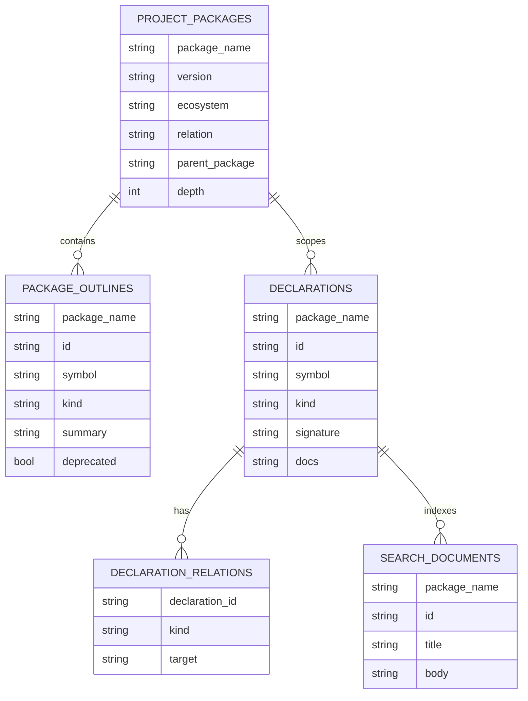

# CodeIQ 内部 SQL / 二维表模型说明（实现层）

本文是 [`spec/api.md`](./api.md) 的配套文档。

`api.md` 定义用户侧 API；本文定义这些 API 背后的 **内部二维表 / SQL 查询模型**。它是实现层 contract，不应直接暴露给最终用户。

---

## 1. 角色定位

用户侧 API 是：

- `FetchPackages`
- `QueryOutlines`
- `Query`

内部实现可以继续把这些 API 统一到一套关系模型上，以获得：

- 一致的查询编排方式
- 更易扩展的 schema
- outlines / exact lookup / fuzzy text 的统一实现
- 更容易做 SDK / Web / AI Agent 自省与调试

因此 SQL 模型的定位是：

> 用统一二维表表达项目包树、公开接口和查询事实层，但不让用户直接写 SQL。

---

## 2. 输入事实来源

新的内部模型建议由两类事实组成：

1. **当前项目上下文事实**
   - `.codeiq/sbom.spdx.json`
   - 当前项目路径
   - `codeiq.yml`

2. **包级接口事实**
   - 公开 declaration / symbol / relation / component 索引
   - 可能来自内部 bundle、物化索引或其它缓存

这意味着：

- 当前项目 SBOM 是入口
- 包级接口索引是查询主体
- SQL 层负责把两者统一投影成可查询二维表

---

## 3. 推荐内部表

## 3.1 `project_packages`

表示当前项目与相关包的树关系。

| 列名 | 含义 |
|------|------|
| `package_name` | 包名 |
| `version` | 版本 |
| `ecosystem` | 生态 |
| `relation` | `root` / `workspace` / `direct` / `transitive` |
| `parent_package` | 父包名 |
| `depth` | 深度 |
| `summary` | 简短摘要 |

## 3.2 `package_outlines`

表示某个包下面所有公开接口的大纲。

| 列名 | 含义 |
|------|------|
| `package_name` | 包名 |
| `id` | 稳定接口 ID |
| `symbol` | 公开符号名 |
| `kind` | 声明种类 |
| `summary` | 摘要 |
| `deprecated` | 是否废弃 |
| `location_uri` | 文件路径 |
| `location_start_line` | 起始行 |
| `location_end_line` | 结束行 |

## 3.3 `declarations`

表示完整声明事实，用于精确查询。

| 列名 | 含义 |
|------|------|
| `package_name` | 包名 |
| `id` | 稳定接口 ID |
| `symbol` | canonical symbol |
| `kind` | 声明种类 |
| `signature` | 规范化签名 |
| `summary` | 摘要 |
| `docs` | 文档文本 |
| `deprecated` | 是否废弃 |
| `location_uri` | 文件路径 |
| `location_start_line` | 起始行 |
| `location_end_line` | 结束行 |

## 3.4 `declaration_relations`

表示声明间稳定关系。

| 列名 | 含义 |
|------|------|
| `package_name` | 包名 |
| `declaration_id` | 声明 ID |
| `kind` | `has_parameter` / `returns` / `implements` / `references_type` 等 |
| `target` | 目标 ID 或符号 |

## 3.5 `search_documents`

用于模糊检索的统一文本视图。

| 列名 | 含义 |
|------|------|
| `package_name` | 包名 |
| `id` | 声明 ID |
| `symbol` | 符号 |
| `kind` | 种类 |
| `title` | 标题文本 |
| `body` | 文档 / 摘要 / 签名拼接文本 |

---

## 4. ER 图



---

## 5. API 到 SQL 的映射

## 5.1 `FetchPackages`

等价于读取 `project_packages`，再按 `parent_package` 组装为树。

```sql
SELECT package_name, version, ecosystem, relation, parent_package, depth, summary
FROM project_packages
ORDER BY depth, package_name;
```

## 5.2 `QueryOutlines(package)`

```sql
SELECT id, symbol, kind, summary, deprecated, location_uri, location_start_line, location_end_line
FROM package_outlines
WHERE package_name = :package
ORDER BY symbol;
```

## 5.3 `Query(package, exact_symbol)`

```sql
SELECT id, symbol, kind, signature, summary, docs, location_uri, location_start_line, location_end_line
FROM declarations
WHERE package_name = :package AND symbol = :exact_symbol
LIMIT 1;
```

## 5.4 `Query(package, exact_id)`

```sql
SELECT id, symbol, kind, signature, summary, docs, location_uri, location_start_line, location_end_line
FROM declarations
WHERE package_name = :package AND id = :exact_id
LIMIT 1;
```

## 5.5 `Query(package, text)`

```sql
SELECT id, symbol, kind, title, body
FROM search_documents
WHERE package_name = :package
  AND body MATCH :text
LIMIT :limit;
```

这里的 `MATCH` 只是示意。最终实现可以是：

- FTS
- trigram
- LIKE + ranking
- 或其它内部索引方案

只要用户侧仍保持 `Query(package, text)` 即可。

---

## 6. 关键边界

### 6.1 用户侧不直接写 SQL

虽然内部模型用 SQL / 二维表表达，但用户侧 API 不暴露：

- SQL 文本
- 表名
- 列名
- `QueryCatalog`
- `QueryResultSet`

这些都只保留给实现层和调试层。

### 6.2 Bundle 仍可作为内部索引来源

内部实现仍可以继续：

- 从 bundle 读取 declaration / symbol / relation / component
- 从 registry 下载内部产物
- 使用 bundle 做持久化与缓存

但这些都不应进入用户侧 API 的命名与响应模型。

### 6.3 当前项目 SBOM 与三方包 SBOM 分离

新的 SQL 入口应优先围绕 **当前项目 SBOM** 构造 `project_packages`。

这意味着：

- 当前项目 `.codeiq/sbom.spdx.json` 是 package tree 的事实来源
- 三方包自己的 SBOM 不再是用户侧 contract 的核心部分
- 三方包更重要的是它们的公开接口索引，而不是它们自己的依赖清单

---

## 7. 结论

下一轮推荐架构是：

- `api.md`：定义用户侧 API
- `sql.md`：定义内部二维表与 SQL 查询模型

这样可以同时满足两点：

1. 用户侧 API 足够简单：`Build`、`Diff`、`FetchPackages`、`QueryOutlines`、`Query`
2. 实现层仍保留足够强的统一查询能力，便于后续扩展 Web / IDE / AI Agent 体验
